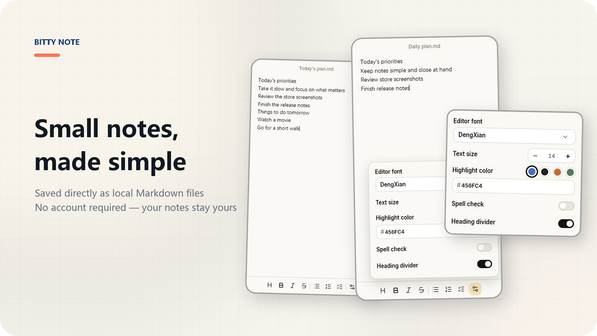
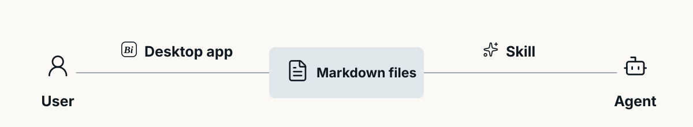

<p align="center">
  
</p>

<p align="center">
  <strong>English</strong> · <a href="./README.md">简体中文</a>
</p>

<p align="center">
  <a href="https://github.com/huangko555/Bitty-Note/releases/latest"></a>
  
  
  <a href="./skills/bitty-note"></a>
</p>

# Bitty-Note

Bitty-Note is a lightweight Windows desktop note app. It keeps everyday notes and tasks within easy reach while storing everything on your own computer.

## Local Markdown files

Every note in Bitty-Note is a `.md` file in your storage folder. There is no account and no content database that only the app can understand. You can open the files directly, use them with other editors, or back them up and move them like any other document.

By default, new users' notes are stored in the `Bitty-Note` folder under Documents. If you change the storage location, your existing notes and archive move with it. Archiving is just as simple—the file is moved to the `Archive` subfolder.

## Manage notes with an Agent

The repository now includes the [Bitty Note Skill](./skills/bitty-note). It tells an Agent where Bitty-Note stores its files and how to handle notes, lists, and tasks correctly. Once installed, you can ask an Agent to record something, add to a list, find an earlier note, or organize unfinished tasks.

The Skill does not add a chat window to the app or move your notes into another database. Bitty-Note remains the everyday interface for reading and editing, while the Agent uses the Skill to work with the same Markdown files.

## How they work together

<p align="center">
  
</p>

You work through Bitty-Note; the Agent works through `$bitty-note`. Both read and write the same storage folder, so there is nothing extra to sync and no second data format to maintain.

## Install the Skill in your Agent

1. Open **Settings** in Bitty-Note and find **Skill**.
2. Click **Get Skill** and copy the text from the dialog.
3. Send the prompt to an Agent that supports Skills and can access local files.
4. Follow the Agent's instructions to finish installing. If needed, reload the Skill or start a new session.

Once installed, you can use it like this:

```text
$bitty-note Note this down: the latest patch needs to ship by Thursday.
$bitty-note Review the PR and add the five highest-impact items to my task list.
$bitty-note Help me organize my earlier notes.
```

## Everyday use

- Write with headings, bold, italic, strikethrough, ordered and unordered lists, task lists, and four text-highlight colors.
- Mix and nest different list types, then drag individual rows or entire heading sections to reorder content.
- Pin, copy, rename, and archive notes; moving one to the system Recycle Bin requires confirmation, and archived notes can be restored.
- Open a note in its own window.
- Keep the window on top, launch Bitty-Note at startup, and remember its position and size.
- Adjust the editor font, text size, heading dividers, and the colors used for headings and list markers.
- Autosave, Simplified Chinese and English interfaces, and in-app updates.

## Download and install

Go to [Releases](https://github.com/huangko555/Bitty-Note/releases/latest) and choose either the installer or the portable build:

- `BittyNote-…-win-Setup.exe`: installs normally and supports in-app updates.
- `BittyNote-win-Portable.zip`: extract it and run the app directly. Keep the packaged files together; do not move only the `.exe`.

Current release builds target **Windows x64**. On first launch, click the `+` in the bottom-right corner of the home screen to create a note.

## Data and privacy

Bitty-Note itself does not require sign-in and does not maintain a cloud copy of your content. If you install the Skill in a third-party Agent, the files it can access and whether it sends content to an external service depend on that Agent's permissions and privacy policy. Before installing, review the Skill and the access you grant.

## License and project documents

Bitty-Note's own source code is released under the [MIT License](./LICENSE).

- [Changelog](./CHANGELOG.md)
- [Privacy Policy](./PRIVACY.md)
- [Code signing policy](./CODE_SIGNING_POLICY.md)
- [Third-party notices](./THIRD_PARTY_NOTICES.md)
