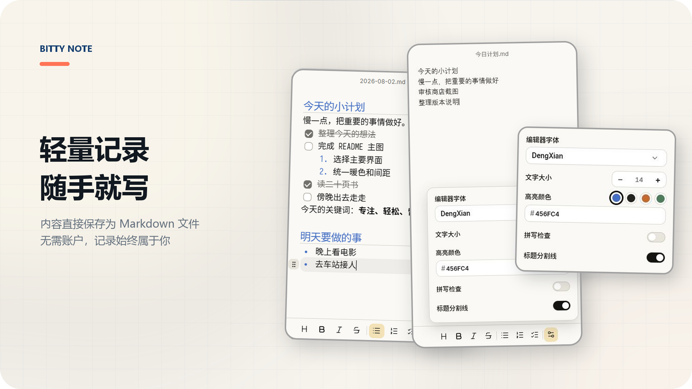

<p align="center">
  
</p>

<p align="center">
  <a href="./README.md">简体中文</a> · <strong>English</strong>
</p>

<p align="center">
  <a href="https://github.com/huangko555/Bitty-Note/releases/latest"></a>
  
  
</p>

## About Bitty-Note

Jot down ideas, lists, and tasks as they come to you. Every note is saved as a local Markdown file, making it easy to view, back up, and move your content.

## Features

- **Plain Markdown storage**: Every note is an ordinary `.md` file, with no proprietary content database.
- **Focused structured editing**: Supports first-level headings, bold, italic, strikethrough, ordered lists, unordered lists, and task lists.
- **Flexible list hierarchy**: Mix and nest different list types, then drag content to reorder it.
- **Note archiving**: Archive notes you no longer need on the home screen and restore them at any time. Permanent deletion requires confirmation.
- **Portable save directory**: Switch storage folders while migrating existing notes and archived content together.
- **Lightweight desktop experience**: Includes always-on-top mode, window dragging and resizing, startup launch, and custom frameless window controls.
- **Adjustable editor**: Choose the editor font and size, and control heading dividers and heading/list-marker highlighting.

## How Notes Are Stored

```text
Create a note
      ↓
Write in the structured editor
      ↓
Save directly as a local Markdown file
      ↓
Edit, archive, move, or open it in another tool
```

For new users, notes are stored by default in the `小记一下` folder under the system Documents directory. Archived notes live in its `归档` subfolder. Bitty-Note does not maintain a separate content database; when you change the save directory, active and archived notes move together.

## Install and Use

1. Download the Windows x64 package from [Releases](https://github.com/huangko555/Bitty-Note/releases/latest).
2. Extract `Bitty-Note-v1.0.2-windows-x64.zip`.
3. Run `小记一下.exe` from the extracted folder.
4. Click the `+` button in the bottom-right corner of the home screen to create your first note.

Bitty-Note is distributed as a folder-based application so it does not need to unpack itself into temporary files on every launch. Keep the other files in the extracted folder together with the `.exe`.

## Third-Party Licenses

Bitty-Note uses third-party resources including Lucide Icons, Sarasa UI SC, Fuzzy Bubbles, and Smiley Sans. See [THIRD_PARTY_NOTICES.md](./THIRD_PARTY_NOTICES.md) for complete copyright and license information.
