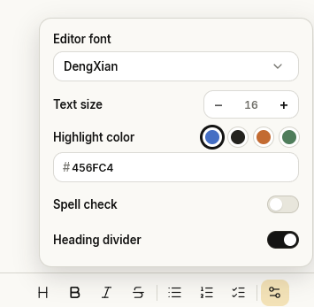

<p align="center">
  
</p>

<p align="center">
  <strong>English</strong> · <a href="./README.zh-CN.md">简体中文</a>
</p>

<p align="center">
  <a href="https://github.com/huangko555/Bitty-Note/releases/latest"></a>
  
  
</p>

## Bitty-Note

Bitty-Note is a lightweight Windows note app for ideas, lists, and everyday tasks. Every note is stored locally as a plain `.md` file, so your writing stays easy to read, back up, move, and open with other tools.

## Highlights

- **Local Markdown files** — no proprietary content database and no account required.
- **Focused editing** — headings, bold, italic, strikethrough, ordered and unordered lists, and task lists.
- **Flexible structure** — mix nested list types and drag blocks to reorder your notes.
- **Archive without losing anything** — archive, restore, or permanently delete notes with confirmation.
- **Portable storage** — choose a different folder and migrate active and archived notes together.
- **Desktop-friendly controls** — always on top, startup launch, frameless window controls, dragging, and resizing.
- **Personalized reading** — choose the editor font and size, heading dividers, and heading/list-marker highlighting.
- **English and Simplified Chinese** — the app starts in English by default and can be switched from Settings.

## Customize the Editor

Open the appearance menu from the right end of the editor toolbar to tailor each note to the way you write:

- Choose the editor font and adjust the text size.
- Pick a preset highlight color or enter a custom hex value for headings and list markers.
- Turn spell check and heading dividers on or off.

Changes take effect immediately and are saved automatically.

<p align="center">
  
</p>

## Your Notes Stay Yours

```text
Create a note
      ↓
Write in the structured editor
      ↓
Save directly as a local Markdown file
      ↓
Edit, archive, move, or open it in another tool
```

For new users, notes are stored in `Documents/Bitty-Note` by default. Archived notes live in its `Archive` subfolder. Bitty-Note does not maintain a separate content database; changing the storage folder moves active and archived notes together.

## Download and Run

1. Download the latest Windows x64 package from [Releases](https://github.com/huangko555/Bitty-Note/releases/latest).
2. Extract the downloaded package.
3. Run `Bitty-Note.exe` and click the `+` button to create your first note.

Keep the files from the package together; do not move only the `.exe`. Velopack-packaged releases check for updates once per day and show a red dot when a new version is available. You can also check manually from Settings.

## License and Policies

Bitty-Note's own source code is released under the [MIT License](./LICENSE).

- [Privacy Policy](./PRIVACY.md)
- [Code signing policy](./CODE_SIGNING_POLICY.md)
- [Third-party notices](./THIRD_PARTY_NOTICES.md)
- [Changelog](./CHANGELOG.md)
