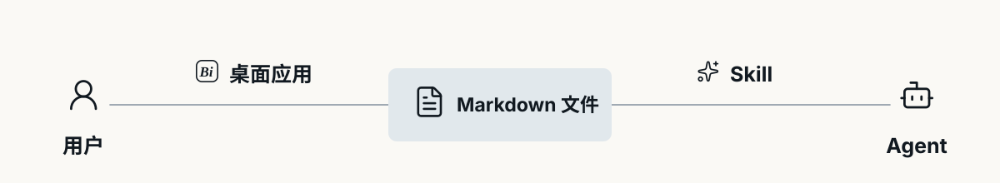

<p align="center">
  
</p>

<p align="center">
  <strong>简体中文</strong> · <a href="./README.en.md">English</a>
</p>

<p align="center">
  <a href="https://github.com/huangko555/Bitty-Note/releases/latest"></a>
  
  
  <a href="./skills/bitty-note"></a>
</p>

# Bitty-Note

Bitty-Note 是一款轻量的 Windows 桌面便签。它把常用的记录和待办留在手边，同时把内容保存在你自己的电脑上。

## 本地 Markdown 文件

在 Bitty-Note 里，每条便签都是保存目录中的一个 `.md` 文件。没有账号，也没有只有软件自己才能读懂的内容数据库。你可以直接打开这些文件，把它们交给其他编辑器，或者像普通文档一样备份和迁移。

新用户的便签默认放在系统“文档”目录下的 `Bitty-Note` 文件夹中；如果你更换保存位置，现有便签和归档也会一起迁移。归档本身同样很简单——文件只是被移到了 `Archive` 子目录。

## 用 Agent 管理便签

仓库中新增了 [Bitty Note Skill](./skills/bitty-note)。它告诉 Agent 去哪里找到 Bitty-Note 的文件，以及怎样正确处理便签、清单和待办。安装以后，你可以让 Agent 帮你记下一件事、补充一份清单、查找过去的记录，或整理尚未完成的任务。

这个 Skill 不会在应用里增加聊天窗口，也不会把便签搬到另一套数据库。Bitty-Note 仍然负责日常的阅读和编辑，Agent 则通过 Skill 操作同一组 Markdown 文件。

## 它们怎样一起工作

<p align="center">
  
</p>

对人来说，入口是 Bitty-Note；对 Agent 来说，入口是 `$bitty-note`。两边最终读写的是同一个保存目录，所以不需要额外同步，也不必在两套数据之间来回转换。

## 把 Skill 装到 Agent

1. 打开 Bitty-Note 的“设置”，找到 **Skill**。
2. 点击“获取 Skill”，复制弹窗中的内容。
3. 把提示词发给支持 Skills、并且能够访问本机文件的 Agent。
4. 按 Agent 的提示完成安装；如有需要，重新加载 Skill 或开启一个新会话。

安装完成后，可以这样使用：

```text
$bitty-note 记一下，最新的修复版要在周四前上线
$bitty-note 审查一下 PR，把价值最高的五项加入待办
$bitty-note 帮我整理我之前的记录
```

## 日常使用

- 支持标题、粗体、斜体、删除线、有序列表、无序列表、任务列表和四色文字高亮。
- 支持列表混合嵌套，以及内容行和标题章节的拖动排序。
- 支持便签置顶、复制、重命名和归档；移至系统回收站前会再次确认，归档记录可以还原。
- 支持在独立窗口中打开便签。
- 支持窗口置顶、开机自启动，并记住窗口位置和大小。
- 支持调整编辑器字体、字号、标题分隔线以及标题和列表标记的颜色。
- 支持自动保存、简体中文与 English 界面，以及应用内更新。

## 下载与安装

前往 [Releases](https://github.com/huangko555/Bitty-Note/releases/latest)，可以选择安装版或便携版：

- `BittyNote-…-win-Setup.exe`：正常安装，并支持应用内更新。
- `BittyNote-win-Portable.zip`：解压后直接运行；请保留压缩包内的文件结构，不要只移动 `.exe`。

目前发布包面向 **Windows x64**。第一次打开后，点击首页右下角的 `+`，就可以新建一条便签。

## 关于数据和隐私

Bitty-Note 本身不要求登录，也不维护云端内容副本。你选择把 Skill 安装到第三方 Agent 时，该 Agent 能访问哪些文件、是否会将内容发送到外部服务，取决于它自身的权限和隐私政策。安装前，请先确认 Skill 的内容以及 Agent 获得的访问范围。

## 协议与项目文档

Bitty-Note 自有源代码采用 [MIT License](./LICENSE) 发布。

- [版本更新记录](./CHANGELOG.md)
- [隐私政策](./PRIVACY.md)
- [代码签名政策](./CODE_SIGNING_POLICY.md)
- [第三方版权与许可说明](./THIRD_PARTY_NOTICES.md)
